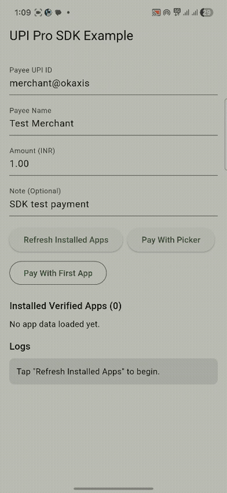

# upi_pro_sdk

[](https://pub.dev/packages/upi_pro_sdk)
[](https://pub.dev/packages/upi_pro_sdk/score)
[](https://pub.dev/packages/upi_pro_sdk)
[](https://opensource.org/licenses/MIT)
[](https://pub.dev/packages/upi_pro_sdk)

A **production-grade** Flutter SDK for seamless UPI (Unified Payments Interface) integration in India.  
Supports UPI intent flow, deep links, VPA validation, payment status polling, and multi-app launchers — all with a clean, type-safe API.

---

## 📱 Demo



---

## ✨ Features

- 🚀 **UPI Intent Flow** — Launch any installed UPI app (GPay, PhonePe, Paytm, BHIM, etc.)
- 🔗 **Deep Link Support** — Generate and handle `upi://` deep links
- ✅ **VPA Validation** — Validate Virtual Payment Addresses before initiating payment
- 📡 **Payment Status Polling** — Poll transaction status with configurable retries
- 📲 **Multi-App Launcher** — Show a bottom sheet with all available UPI apps
- 🔒 **Type-Safe Models** — Strongly typed `UpiPaymentRequest`, `UpiPaymentResponse`
- 🧪 **Fully Testable** — Injectable dependencies, mockable interfaces
- 📱 **Android & iOS** — Works on both platforms

---

## 📦 Installation

Add to your `pubspec.yaml`:

```yaml
dependencies:
  upi_pro_sdk: ^0.1.0
```

Then run:

```bash
flutter pub get
```

---

## ⚙️ Platform Setup

### Android

Add the following to `android/app/src/main/AndroidManifest.xml` inside `<manifest>`:

```xml
<queries>
  <intent>
    <action android:name="android.intent.action.VIEW" />
    <data android:scheme="upi" />
  </intent>
</queries>
```

### iOS

Add the following to `ios/Runner/Info.plist`:

```xml
<key>LSApplicationQueriesSchemes</key>
<array>
  <string>upi</string>
  <string>gpay</string>
  <string>phonepe</string>
  <string>paytmmp</string>
</array>
```

---

## 🚀 Quick Start

### 1. Initialize the SDK

```dart
import 'package:upi_pro_sdk/upi_pro_sdk.dart';

final upiClient = UpiProClient(
  merchantId: 'your_merchant_id',
  merchantName: 'Your Business Name',
);
```

### 2. Initiate a Payment

```dart
final request = UpiPaymentRequest(
  payeeVpa: 'merchant@okaxis',
  payeeName: 'Acme Pvt Ltd',
  amount: 499.00,
  transactionId: 'TXN_${DateTime.now().millisecondsSinceEpoch}',
  transactionNote: 'Order #1042 payment',
  currency: 'INR',
);

try {
  final response = await upiClient.initiatePayment(request);

  switch (response.status) {
    case UpiPaymentStatus.success:
      print('Payment successful! UPI Ref: ${response.upiTransactionId}');
      break;
    case UpiPaymentStatus.pending:
      print('Payment pending. Poll for status.');
      break;
    case UpiPaymentStatus.failure:
      print('Payment failed: ${response.responseCode}');
      break;
  }
} on UpiException catch (e) {
  print('UPI Error: ${e.message} (code: ${e.code})');
}
```

### 3. Launch Multi-App UPI Selector

```dart
await upiClient.showAppChooser(
  context: context,
  request: request,
  onResponse: (UpiPaymentResponse response) {
    // handle response
  },
);
```

### 4. Validate a VPA

```dart
final result = await upiClient.validateVpa('user@oksbi');

if (result.isValid) {
  print('VPA is valid. Name: ${result.name}');
} else {
  print('Invalid VPA');
}
```

### 5. Poll Payment Status

```dart
final status = await upiClient.pollPaymentStatus(
  transactionId: 'TXN_1234567890',
  maxRetries: 5,
  retryInterval: Duration(seconds: 3),
);

print('Final status: ${status.status}');
```

---

## 🗂️ API Reference

### `UpiProClient`

| Method                                         | Description                                |
| ---------------------------------------------- | ------------------------------------------ |
| `initiatePayment(request)`                     | Initiates UPI payment via intent           |
| `showAppChooser(context, request, onResponse)` | Shows installed UPI apps in a bottom sheet |
| `validateVpa(vpa)`                             | Validates a Virtual Payment Address        |
| `pollPaymentStatus(transactionId)`             | Polls for transaction status               |
| `getInstalledUpiApps()`                        | Returns list of installed UPI apps         |

### `UpiPaymentRequest`

| Field           | Type     | Required | Description                           |
| --------------- | -------- | -------- | ------------------------------------- |
| `payeeVpa`      | `String` | ✅       | Payee's VPA (e.g., `merchant@okaxis`) |
| `payeeName`     | `String` | ✅       | Payee display name                    |
| `amount`        | `double` | ✅       | Amount in INR                         |
| `transactionId` | `String` | ✅       | Unique transaction ID                 |

### `UpiPaymentResponse`

| Field              | Type               | Description                        |
| ------------------ | ------------------ | ---------------------------------- |
| `transactionId`    | `String`           | Your transaction ID                |
| `upiTransactionId` | `String?`          | UPI network transaction ID         |
| `status`           | `UpiPaymentStatus` | `success`, `pending`, or `failure` |
| `responseCode`     | `String?`          | UPI response code                  |
| `approvalRefNo`    | `String?`          | Bank approval reference            |

---

## 🧪 Testing

```dart
// Use the mockable interface for unit tests
final mockClient = MockUpiProClient();

when(() => mockClient.validateVpa(any())).thenAnswer(
  (_) async => VpaValidationResult(isValid: true, name: 'Test User'),
);
```

Run tests:

```bash
flutter test
```

---

## 📋 Supported UPI Apps

| App            | Android | iOS |
| -------------- | ------- | --- |
| Google Pay     | ✅      | ✅  |
| PhonePe        | ✅      | ✅  |
| Paytm          | ✅      | ✅  |
| BHIM           | ✅      | ✅  |
| CRED           | ✅      | ✅  |
| Other UPI Apps | ✅      | ⚠️  |

---

## 🤝 Contributing

Contributions are welcome! Please read [CONTRIBUTING.md](CONTRIBUTING.md) first.

1. Fork the repo
2. Create a feature branch: `git checkout -b feat/your-feature`
3. Commit your changes: `git commit -m 'feat: add your feature'`
4. Push and open a PR

---

## 📄 License

MIT License — see [LICENSE](LICENSE) for details.

---

## 🙏 Acknowledgements

Built with ❤️ for the Indian Flutter developer community.  
Follows [NPCI UPI Linking Specifications](https://www.npci.org.in/what-we-do/upi/product-overview).
